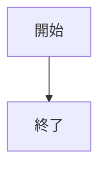
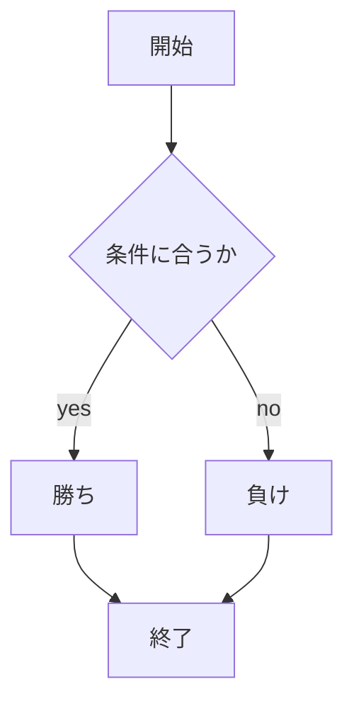

# webpro_06　
##　このプログラムについて
## ファイル一覧
ファイル名 | 説明
-|-
app5.js | プログラム本体
public/janken.html | じゃんけんの開始画面

```javascript
console( 'HELLO');
```
1. ```node apple5.js```でプログラムを起動する．
2. Webブラウザで```localhost:8080/public/janken.html```にアクセスする．
3. 自分の出したいじゃんけんの手を入力する．






